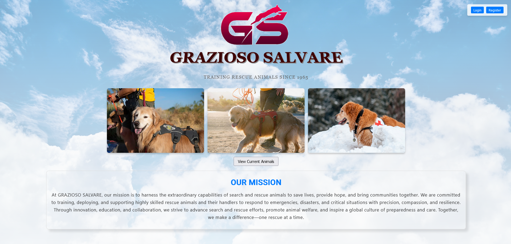
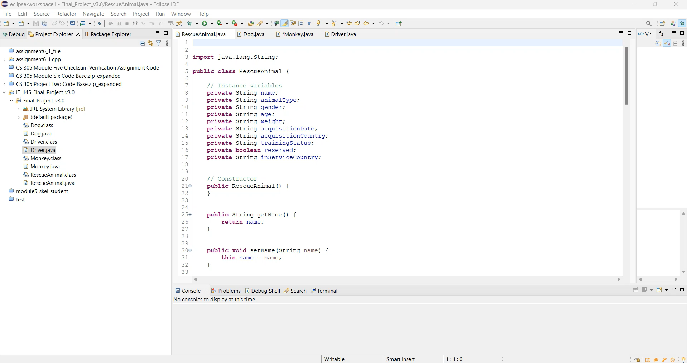
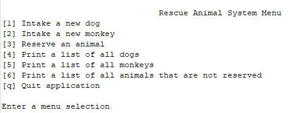
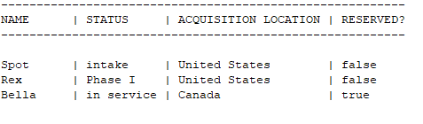
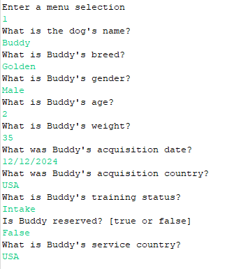
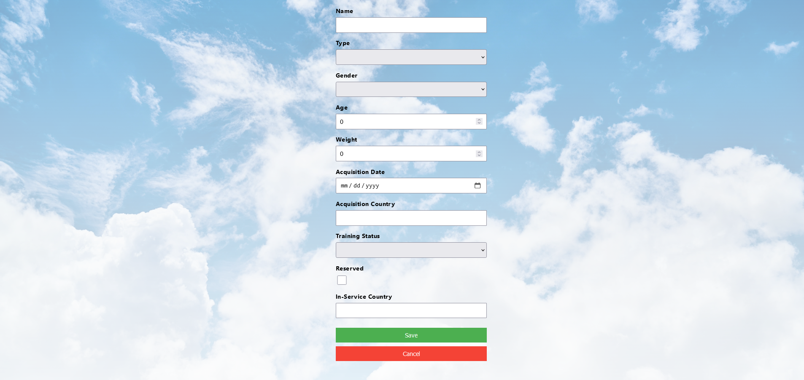
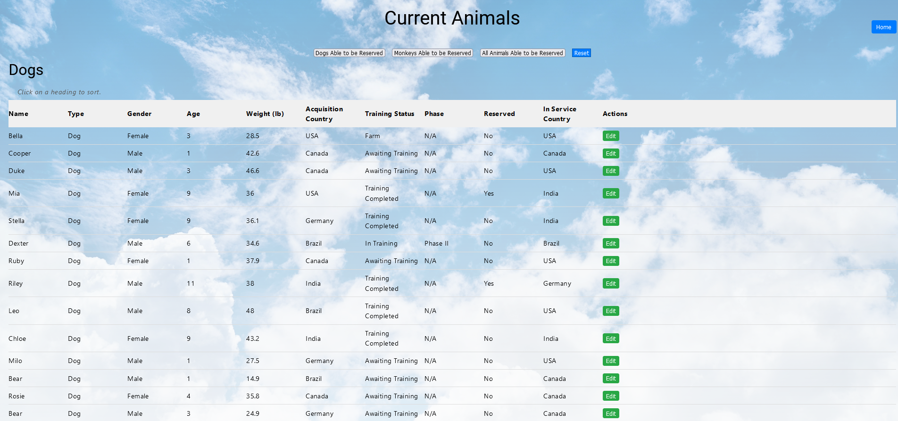
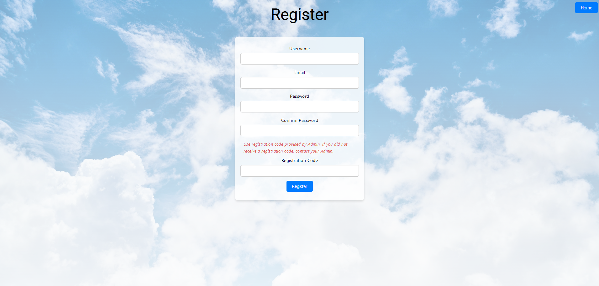

  

# Christopher King SNHU CS-499 Capstone-ePortfolio

---
# Contents

[OVERVIEW](#overview)\
[Code Review](#code-review)\
[Original Program Guidelines and Code](#original-program-guidelines-and-code)\
[Screenshots of Original Project](#screenshots-of-original-project)\
[Plan](#plan)\
[Project Reflection](#project-reflection)\
[Video of Enhanced Project](#video-of-enhanced-project)\
[Screenshots of Enhanced Project](#screenshots-of-enhanced-project)\
[Various Links](#various-links)

---

Professional Self-Assessment

The completion of my coursework and the development of my ePortfolio have been pivotal in showcasing my strengths, shaping my professional goals and values, and preparing me to thrive in the field of computer science. Throughout the program, I have honed technical skills and cultivated a mindset geared towards problem-solving and innovation. These experiences have not only strengthened my employability but have also solidified my commitment to continuous learning and excellence in this dynamic field.

One of the most transformative aspects of my education has been **communicating with stakeholders**. In various projects, including my capstone, I practiced presenting technical concepts to non-technical audiences, tailoring my approach to ensure clarity and engagement. This skill is vital in bridging the gap between technical teams and business stakeholders, and it has prepared me to be an effective advocate for technical solutions in real-world scenarios.

My understanding of **data structures and algorithms** has been a cornerstone of my problem-solving abilities. For instance, designing efficient algorithms to handle complex operations in my projects demonstrated my ability to optimize performance and scalability. These skills were further enhanced by applying them in practical settings, such as optimizing search functionalities in database-driven applications.

In **software engineering and database management**, I have demonstrated proficiency in full-stack development, transitioning standalone applications into robust, scalable solutions. My capstone project highlights my ability to integrate technologies like MongoDB and implement design patterns such as the Factory Method to enhance code maintainability and extensibility. These experiences reflect my ability to design and implement systems that meet user needs while adhering to best practices in software development.

The importance of **security** became increasingly apparent as I advanced through the program. Early projects laid the foundation for understanding secure coding practices, while later work emphasized the integration of authentication and authorization mechanisms, such as using JWTs for secure user sessions. My capstone underscored the need to consider security throughout the software development lifecycle, a lesson I will carry into my professional career.

---

# OVERVIEW

For my final project in the SNHU CS-499 Capstone, I demonstrated the knowledge and skills acquired throughout my Bachelor of Science in Computer Science program. The project involved selecting a previously developed program or set of programs and enhancing them in three key categories: Software Design and Engineering, Algorithms and Data Structures, and Databases. I chose to focus on a single program, applying enhancements across all three categories to showcase a comprehensive approach to software development. 

---

# Code Review

I conducted a code review addressing three key computer science categories: software engineering and design, algorithms and data structures, and databases. The code review was submitted as a video walkthrough where I analyzed existing code for weaknesses, limitations, and vulnerabilities, while proposing enhancements to improve functionality, structure, and efficiency. Click the link below the image to view my code review on YouTube.

  

https://youtu.be/SGY3JVHHWBs

---

# Original Program Guidelines and Code

## Grazioso Salvare Specification

## Overview
Grazioso Salvare primarily uses dogs as search and rescue animals but plans to train monkeys for similar purposes. 
- Dogs initially receive an "intake" status before beginning training. 
- As training progresses, their status changes through five phases: **Phase I to Phase V**. 
- Dogs that successfully complete training gain **"in-service"** status and are designated as Rescue Animals. 
- Those unable to complete training are assigned **"farm"** status, indicating they will retire on a Grazioso Salvare farm.

## Animals
When acquiring a dog, Grazioso Salvare tracks the following details:
- **Name**
- **Breed**
- **Gender**
- **Age**
- **Weight**
- **Acquisition date and location**

Additionally, the organization records:
- The dog's training status.
- If the dog is "in-service," its assigned country and reservation status.

## Special Considerations for Monkeys
The organization is expanding its system to accommodate tracking monkeys. The following monkey species are eligible for training:
- **Capuchin**
- **Guenon**
- **Macaque**
- **Marmoset**
- **Squirrel Monkey**
- **Tamarin**

Unique attributes for monkeys include:
- **Tail length**
- **Height**
- **Body length**
- **Species**

## Required Functionality

### Monkey Class
- Extend the `RescueAnimal` class.
- Include monkey-specific attributes.
- Implement accessor (getter) and mutator (setter) methods for all attributes.

### Driver Class
Add a **menu-driven loop** that:
1. Displays the provided menu.
2. Collects and validates user input.
3. Executes actions based on user selections.

#### Implement the following methods:
- **Intake a new dog**:
  - Prompt for and validate user inputs.
  - Populate dog attributes.
  - Add the dog to an `ArrayList`.

- **Intake a new monkey**:
  - Validate inputs, including name and species.
  - Populate monkey attributes.
  - Add the monkey to an `ArrayList`.

- **Reserve an animal**:
  - Identify animals matching user criteria from the `ArrayList`.
  - Update the `reserved` status if a match is found.
  - Provide feedback if no match exists.

- **Display animal information**:
  - Print lists of:
    - All dogs.
    - All monkeys.
    - Animals that are "in-service" and available (not reserved).

\
Below is a link to my original code that I completed in IT-145

[Original_Program/IT_145_Final_Project_v3.0/Final_Project_v3.0](https://github.com/CK439224/Capstone-ePortfolio.github.io/tree/main/Original_Program/IT_145_Final_Project_v3.0/Final_Project_v3.0)

# Screenshots of Original Project

| | | |
|:-------------------------:|:-------------------------:|:-------------------------:|
Original Menu  | Original List  | Original Intake 

---

# Plan

### Category One: Software Engineering and Design

- To enhance the Rescue Animal program by converting it into a website, I will develop a full-stack web application that retains and expands the core functionality of the original Java program. For this project, I will use a technology stack that includes a JavaScript framework (such as Angular) for the frontend, Node.js with Express for the backend, and MongoDB as the database. This combination provides a scalable and flexible environment for both animal management and adoption processing, making the program accessible to a broader audience online.

### Category Two: Algorithms and Data Structures

- **Querying and Indexing with MongoDB**  
  Since I will be using MongoDB, the enhancement plan will leverage MongoDB's built-in capabilities for fast querying, indexing, and sorting, rather than implementing custom algorithms for these tasks. MongoDB’s NoSQL structure offers efficient data retrieval through native querying and indexing, making it well-suited for handling large datasets without additional custom code for searching, filtering, and sorting.

- **Filtering by Animal Type**  
  When filtering animals by type (e.g., Dog or Monkey), MongoDB’s indexing capabilities enable rapid lookups. By creating an index on the `type` field, MongoDB's query functions can retrieve all animals of a specific type efficiently. This approach achieves similar speed benefits to a hash table without additional implementation.

- **Sorting by Adoption Status**  
  For sorting animals by adoption status, MongoDB offers a `.sort()` method that allows sorting by any field, including reservation status. By applying an index on this field, MongoDB can sort large datasets quickly, providing the performance benefits of custom algorithms like merge sort directly within the database.

- **Optimized Query System**  
  Overall, MongoDB’s indexing and querying system provides the efficiency that custom algorithms would offer in a traditional setup, allowing us to optimize database indexing and query structuring instead. This approach achieves the same user-facing benefits—fast searches, efficient filtering, and responsive sorting—while aligning closely with MongoDB's architecture to ensure scalability and high performance.

### Category Three: Databases

To enhance the Rescue Animal program in alignment with database management best practices, I will focus on designing an optimized MongoDB database schema, integrating indexing, creating relationships, and implementing data validation. This plan aims to improve the efficiency, organization, and reliability of data storage and retrieval processes, aligning with the program’s expanded functionality needs.

- **Schema Design**  
  The schema consists of one main collection: `Animals`. The `Animals` collection will store all necessary details about each animal, including fields like `name`, `type`, `breed`, `age`, `description`, and `reservationStatus`. To optimize data retrieval, indexing will be applied to frequently used fields such as `type` and `reservationStatus`. This indexing allows for quick filtering, making it easy for users to search by type (e.g., Dog, Monkey) and by adoption status (e.g., Available, Reserved).

- **Data Validation**  
  Data validation will focus on ensuring accurate and complete entries within the `Animals` collection. Required fields like `name` and `type` will be enforced, and `reservationStatus` will use predefined values (`Available`, `Reserved`, `Pending`) to maintain data consistency and reliability.

---

# Project Reflection

Starting this project early allowed me to maintain a steady pace and gave me extra time to address potential challenges. This approach proved beneficial as I transitioned the original standalone Java application into a full-stack application, showcasing an enhanced understanding of software design and development. I made significant improvements, including better encapsulation and the implementation of design patterns, such as the Factory Method in `RescueAnimal.java`. Additionally, I integrated MongoDB for database functionality, enabling seamless data handling between the front-end and back-end.

While I have achieved many milestones, such as creating an intuitive user interface and establishing smooth interactions with MongoDB, I recognized that there was still more to do. I planned to refine the front-end further, enhance database interactions to support additional features, and improve the filters available in the animal list. Furthermore, I aimed to restrict user registration by requiring approval or limiting it to specific individuals, ensuring better control over access.

I believe my project demonstrates evidence of improvement across all key areas. However, in hindsight, I realize that I should have prioritized security measures throughout the project rather than treating it as a final step. Although I have implemented some security measures, I still had to fine-tune the existing ones and introduce additional safeguards to ensure the application is robust and secure. 

This reflection highlights both my progress and my commitment to continuously improving my work, leveraging the knowledge and skills I’ve gained throughout my academic journey.

---

# Video of Enhanced Project

Click on the link below to see a short video of my completed project.

  

  https://youtu.be/FC-kc5ZNhuk

---

# Screenshots of Enhanced Project

| | | |
|:-------------------------:|:-------------------------:|:-------------------------:|
Enhanced Homescreen  | Enhanced Intake  | Enhanced Animal List  |
Enhanced Login  | Enhanced Register 

---

# Various Links

[Original Program](https://github.com/CK439224/Capstone-ePortfolio.github.io/tree/main/Original_Program)

[Final Rescue Animals App Code](https://github.com/CK439224/Capstone-ePortfolio.github.io/tree/version_4)

[Files submitted during Term](https://github.com/CK439224/Capstone-ePortfolio.github.io/tree/main/Submitted_Files)

---
[Back to top](#top)
